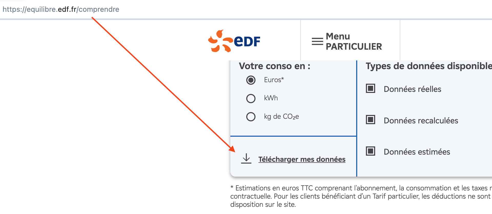

Le contrat EDF Tempo est une offre d'électricité avec un tarif variable selon les jours, divisés en trois couleurs (bleu, blanc, rouge) indiquant des tarifs différents, les jours rouges étant les plus chers. Cette offre vise à encourager la consommation hors des périodes de pointe.


# Recuperation des données

Le site EDF vous propose de télécharger toutes vos données de consommation, en CSV:


```python
import pandas as pd

def update_file(input_file_path, output_file_path):
    with open(input_file_path, 'r', encoding='ISO-8859-1') as file:
        lines = file.readlines()

    current_date = None
    updated_lines = []

    for line in lines:
        
        line = line.strip()
        if line.endswith(';;'):
            
            current_date = line.split(';;')[0]
        else:
            
            if current_date:
                updated_line = f"{current_date};{line}"
                if not updated_line.endswith(';'):
                    updated_lines.append(updated_line)

    
    with open(output_file_path, 'w', encoding='ISO-8859-1') as file:
        for line in updated_lines:
            file.write(line + '\n')


input_file_path = 'datas/mes-puissances-atteintes-30min-1640-64.csv'
output_file_path = 'datas/mes-puissances-atteintes-30min-cleaned.csv'
update_file(input_file_path, output_file_path)

```


